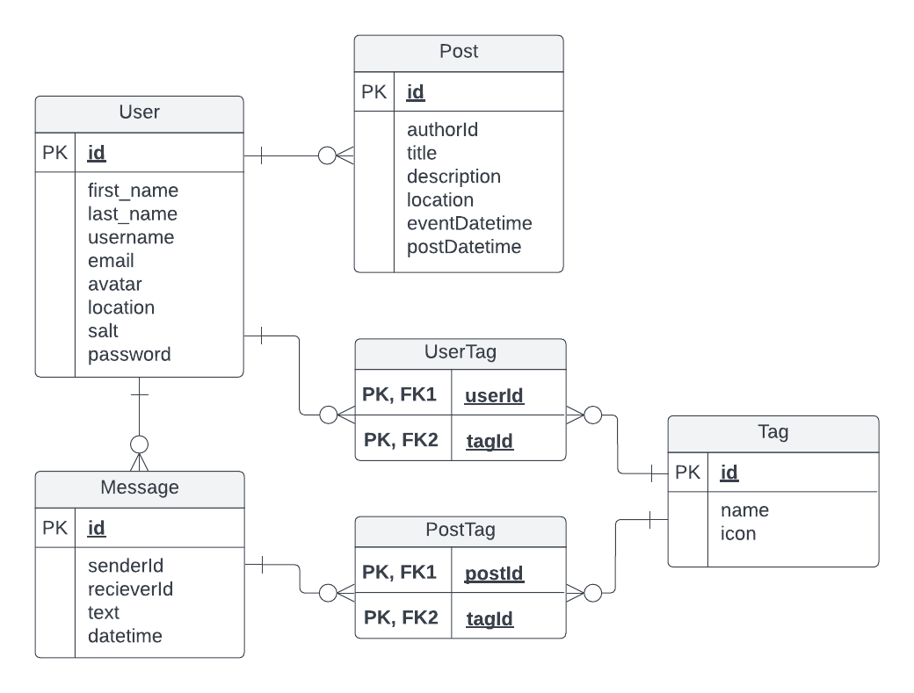

# Group D: Final Project
### Pack Producer

## Final Project Report

  ### List of Pages
  Page       | Route                              | Description/How to get there
  ---------- | ---------------------------------- | ---------
  Login      | `/login`                           | If the user is not authenticated, they will automatically be redirected here.
  Dashboard  | `/`                                | This is the main page of Pack Producer; once you are first authenticated you will be directed here. Alternatively, you can visit this page by clicking the "Pack Producer" text in the navigation bar.
  Make a Post | `/post`                           | Where you can make a post for an event. The first tab in the navigation bar.
  Explore Posts | `/explore`                      | The place to find events posted by other users (as well as your own). The second tab in the navigation bar.
  Message Users | `/message`                      | Ability to message others about going to posts made by them. The third tab in the navigation bar.
  View an Event Posting | `/event?id=postId`      | Shows information about a post. Navigate to this page by clicking on a post on the Post page.
  Edit a Post | `/editPost?id=postId`             | Allows a user to edit a post they made. Navigate to this page by viewing a page you have made and clicking 'edit.'
  Direct Message a User | `/dm?id=userId`         | Allows a user to direct message another user. This page is found by selecting a chat in the Message Users page or selecting a message on the Dashboard.
  Account Page | `/account`                       | Shows account information and allows a user to edit an account. This is the far right tab on the navigation bar.

  
  ### Caching Strategy
  Our current caching strategy is Cache-First. This works, and gracefully provides offline functionality, though the information in the messages and post pages are not quite updated correctly. This could work and we may decide to keep this (as the user has not actually posted yet), however, it would probably be better to implement a network-first strategy. This is described in more detail above.
  
  ### API Endpoints
  Method | Route                              | Description
  ------ | ---------------------------------- | ---------
  `POST` | `/users/login`                     | Logs a user in, authenticating the user to ensure they are in the list of known users.
  `POST` | `/users/logout`                    | Logs a user out, clearing token/cookie information.
  `GET`  | `/users/current`                   | Get the currently authenticated user.
  `GET`  | `/users/:userId`                   | Get a specified user by ID.
  `PUT`  | `/users/`                          | Updates the given user account.
  `POST` | `/users`                           | Creates a new user.
  `GET`  | `/posts`                           | Gets all posts made in the system.
  `POST` | `/posts`                           | Creates a new post.
  `PUT`  | `/posts`                           | Edits a given post.
  `DELETE`| `/posts/:postId`                  | Deletes a given post.
  `GET`  | `/posts/users/:userId`              | Gets all posts created by a specific user.
  `GET`  | `/posts/:postId`                   | Gets a specific post by ID.
  `GET`  | `/messages`                        | Get all messages currently in the system.
  `GET`  | `/messages/sender/:senderId`       | Gets all messages sent by a particular user.
  `GET`  | `/messages/reciever/:recieverId`   | Gets all messages received by a particular user.
  `GET`  | `/messages/direct/:senderID/:recieverId` | Gets all messages sent and recieved by particular users.
  `POST` | `/messages`                        | Send a message to a particular user.
  
  ### Database Schema ER Diagram
  

  ### Contributions
  Item | Contributer
  -------- | -----------
  All Current Contributions Since Milestone 2 | Christopher
